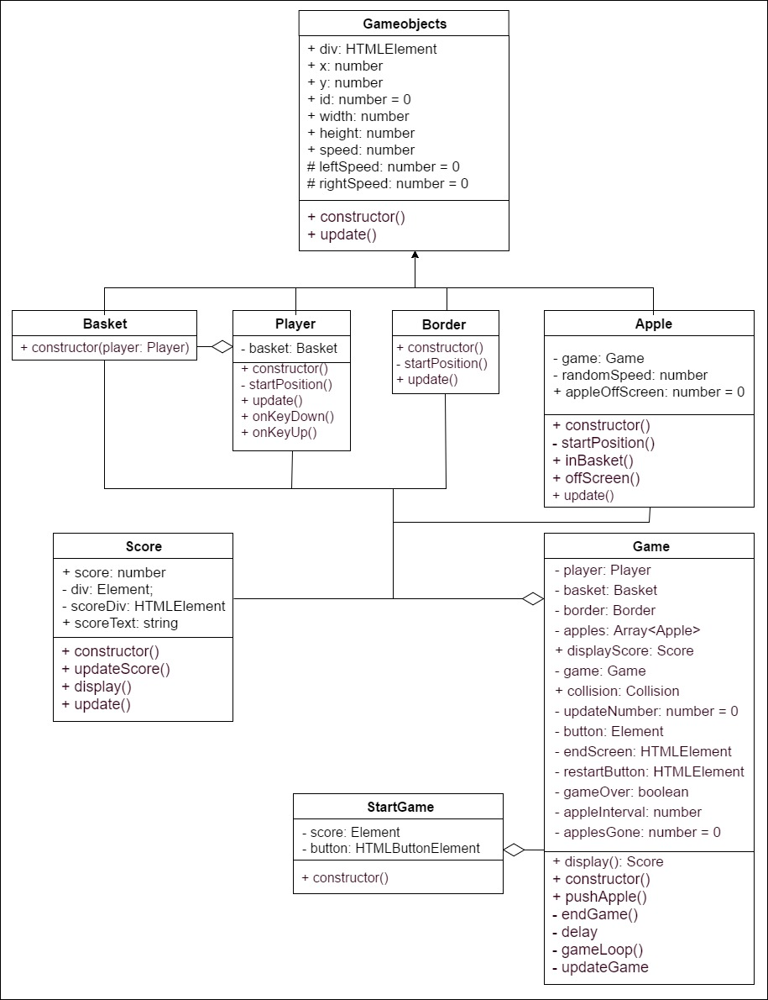

# Apple catcher game - Vilayat Kleer

## What is this game about?

The game is made in Visual Studio Code, using Typescript. I had to make a game for my Programming 04 class using certain guidelines. I've made a bulletin with the features of the game:

- Start screen so you can choose when to play
- Control the basket snail using the [A] and [D] key
- The basket snail contains 2 objects: The snail and the basket. The snail spawns a basket on it's back, completing the composition
- The basket snail can catch apples through collision
- The snail, basket and apples have a parent class called gameobjects.ts, inheriting the variables through 'extends'
- All children access the variables using the 'super();'
- An on screen score counting how many apples you've caught
- An end screen when all the apples have dropped
- A restart button on the end screen so you can try to improve your score
- Using encapsulation to declare the variables

## Installation or play

To play the game, go to https://0907661.github.io/apple-catcher/. That's it!
If you want to install the game, you can fork, clone or download this repository. Place all the files in a folder where you can host the game locally with XAMPP for example. You are free to edit the game yourself, just make sure you install typescript.

## UML

I've places the UML below to show how all the classes relate to one another.

